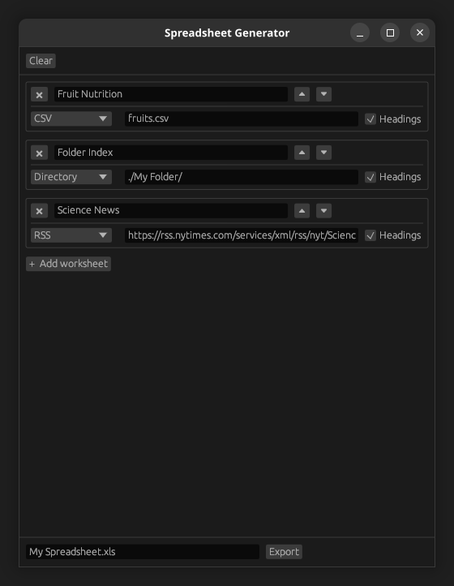

# Spreadsheet Generator

A tool for generating XLS-formatted spreadsheets from various sources, available as either a command-line utility or GUI application.

This was made for a school project.

## Graphical tool (`sheet-gen-gui`)

**Run:** `cargo run --bin sheet-gen-gui`

**Screenshot** *(Ubuntu, Linux)* **:**



## Command-line tool (`sheet-gen`)

**Run:** `cargo run --bin sheet-gen`

**Help:**

```
Usage: sheet-gen [OPTIONS]

Generates an XLS-formatted spreadsheet.

Options:
    -h, --help          Display this message
    -w TITLE            Set worksheet title
    -H                  Disable table headings
    -c PATH             Set table source to CSV
    -d PATH             Set table source to directory
    -r PATH             Set table source to RSS
    -o PATH             Set output file

Syntax help:
    1.  Worksheets are built in sequences which end in a source option (-c, -d,
        or -r).
    2.  When a source option is encountered, a worksheet target is built from
        the previous options, and the flags are reset for the next worksheet.
    3.  Only the last output option will be acknowleged.
    4.  When no output is given, the XML data is printed to stdout.

Example:
    .---------------------------------------------.
    | $ sheet-gen                                 |
    |   -w "First Worksheet" -r "rss.example.com" |
    |   -w "Second Worksheet" -H -c "users.csv"   |
    |   -w "Third Worksheet" -c "data.csv"        |
    |   -o my_spreadsheet.xls                     |
    `---------------------------------------------'

    This will create a spreadsheet with the following worksheets:
        1.  titled "First Worksheet",
            from RSS feed at "rss.example.com"
        2.  titled "Second Worksheet",
            from CSV file "users.csv",
            without headings
        3.  titled "Third Worksheet",
            from CSV file "data.csv",
            with first row interpreted as headings
    ... all exported to file "my_spreadsheet.xls"
```
